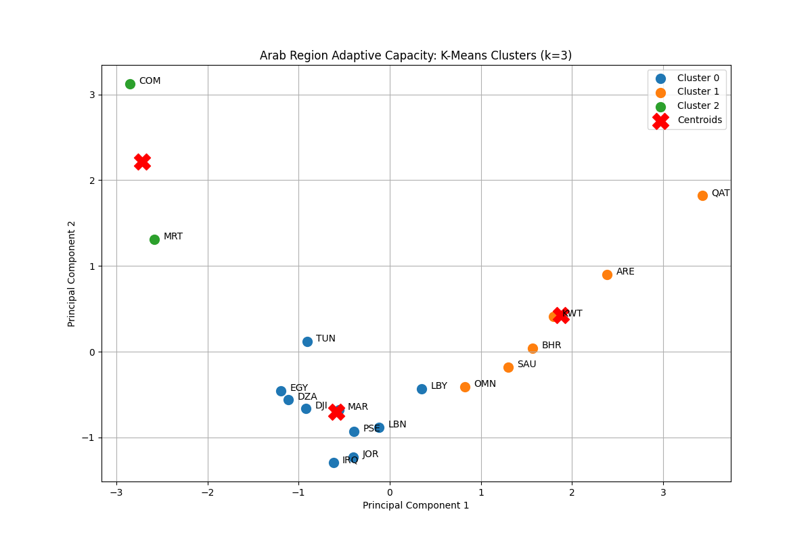

#  Arab Region Climate Adaptive Capacity: K-Means Clustering


##  Project Overview
Adaptive capacity to climate change is driven by a complex web of socio-economic and infrastructural factors. This project utilizes unsupervised machine learning to uncover hidden structural profiles across the Arab region, moving beyond traditional geographic or income-based groupings.

By applying **Principal Component Analysis (PCA)** and **K-Means Clustering** to macroeconomic and development indicators, this model mathematically segments 22 Arab League states into distinct "Resilience Profiles" to inform targeted policy interventions.

##  Methodology & Pipeline

### Phase 1: Automated Data Extraction
* Utilized the `wbgapi` to programmatically extract 2022 socio-economic indicators from the World Bank.
* **Core Drivers Analyzed:** GDP per capita, Female Labor Force Participation, Agricultural Dependency (% of GDP), and Internet Penetration.

### Phase 2: Dimensionality Reduction
* Standardized features using a Z-score transformation (`StandardScaler`) to neutralize magnitude bias.
* Applied **Principal Component Analysis (PCA)** to compress the multi-dimensional economic data down to 2 principal components, successfully capturing **94.69% of the original variance**.

### Phase 3: Unsupervised Learning & Clustering
* Executed the **K-Means** algorithm, using the mathematical **Elbow Method** to prove the optimal number of clusters ($k=3$).
* Segmented the region into three distinct policy groups based purely on their structural data.

##  Key Findings & Centroid Analysis
The algorithm successfully identified three distinct socio-economic profiles without any geographic prompting:

1. **Cluster 1 (High Economic Capacity / Digital Infrastructure):** The Gulf Cooperation Council (GCC) states (e.g., Qatar, UAE, Saudi Arabia). Characterized by high GDP and advanced digital infrastructure, possessing strong economic baseline resilience.
2. **Cluster 0 (Moderate Capacity / Mixed Vulnerability):** The Levant and North Africa (e.g., Lebanon, Jordan, Morocco). Transitional economies with moderate digital infrastructure and a mix of service/agricultural sectors.
3. **Cluster 2 (Agrarian / High Vulnerability):** E.g., Comoros, Mauritania. Highly dependent on agriculture with lower technological and economic baselines, requiring immediate, specialized developmental support.



## Repository Structure

```text
├── data/
│   ├── arab_region_adaptive_capacity_data.csv   # The raw API data
│   └── arab_region_clusters_final.csv           # The final dataset with Cluster IDs
├── scripts/
│   └── climate_clustering_model.py              # The complete Python pipeline
├── images/
│   └── clusters_plot.png                        # Scatter plot visualization of the clusters
├── .gitignore                                   # Standard Python gitignore
├── requirements.txt                             # Python dependencies (wbgapi, pandas, etc.)
└── README.md                                    # Project documentation

##  How to Run
1. Clone the repository: `git clone https://github.com/RawanALGharib/Arab-region-adaptive-capacity-clustering`
2. Install dependencies: `pip install -r requirements.txt`
3. Run the Python file to execute the pipeline: `python scripts/climate_clustering_model.py`


